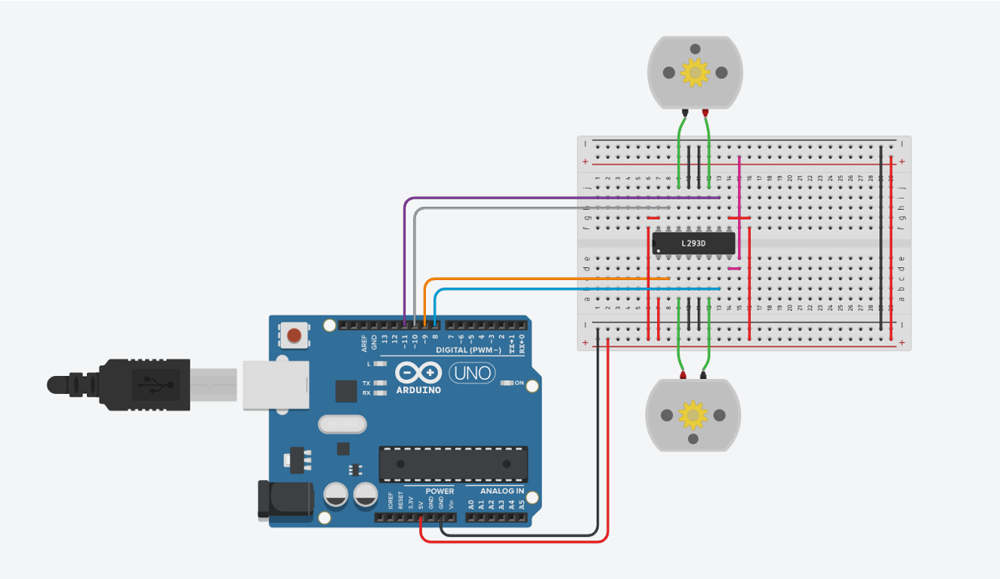

# SCHRÖDINGER's CAT

## Description
Developted an Arduino project to simulate a car directions control.

 - Simulated the ***foward, reverse, turn left*** and ***turn right*** functions.
 - Controled by the **Serial Monitor**.

---

## Circuits Connections

 - The **5V** connected to the protoboard
 - The **GND** connected to the protoboard



 - Pin **8** as **OUTPUT**, connected to the **Input 2** of the *L293D*
 - Pin **9** as **OUTPUT**, connected to the **Input 1** of the *L293D*
 - Pin **10** as **OUTPUT**, connected to the **Input 4** of the *L293D*
 - Pin **11** as **OUTPUT**connected to the **Input 3** of the *L293D*

```C++
    pinMode(8, OUTPUT);
    pinMode(9, OUTPUT);
    pinMode(10, OUTPUT);
    pinMode(11, OUTPUT);
```

 - **Motor 1**:
    - **Terminal 1** connected to the **Output 2** of the *L293D*
    - **Terminal 2** connected to the **Output 1** of the *L293D*

 - **Motor 2**:
    - **Terminal 1** connected to the **Output 4** of the *L293D*
    - **Terminal 2** connected to the **Output 3** of the *L293D*

> The **GND** and **5V** should be connected from both sides of the protoboard

---
## Usage
To make use of this repository correctly, follow the next steps.

1. First of all you would need to clone this repository, in the terminal put the next code to clone this repository:

```sh
    git clone https://github.com/Rafael-Anguiano/Car-Directions.git
    cd Car-Directions/
```

2. Make the connections shown [above](#Circuits-Connections)

3. Once you have made the connections, you need to open the [Car-Directions.ino](./Car-Directions.ino) code in an **Arduino Simulator** or an **Arduino IDE** 
4. Upload the code to your Arduino and you would be ready to go.

> 5. In the *Serial Monitor* you can write to control the direction of the motors:
>       - *"a"* to go **Foward**.
>       - *"r"* to use **Reverse**.
>       - *"d"* to **Turn right**.
>       - *"i"* to go **Turn Left**.

---

## Developed By:
 Rafael de Jesús Anguiano Suárez del Real (March 2021)
